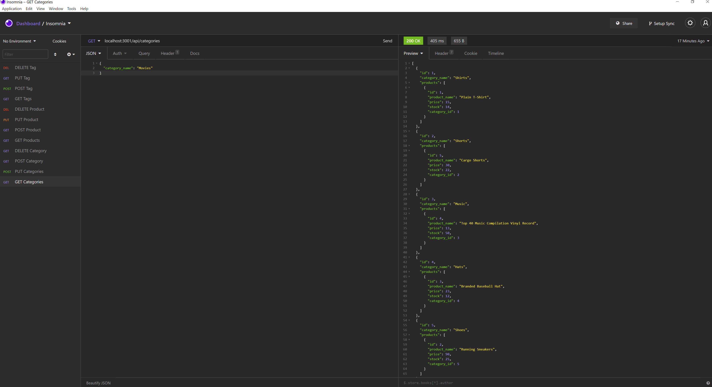

# E-Commerce Back-End
  [](https://opensource.org/licenses/ISC)

  ## Description
  Completed the Back-End process for an E-Commerce program that uses GET, POST, PUT, and DELETE to configure products within a database, and displaying the code through Insomnia.
  
  ## Table of Contents
  * [Installation](##-installation)
  * [Usage](##-usage)
  * [Demo](##-demo)
  * [License](##-license)
  * [Questions](##-questions)
  
  ## Installation
  To install the necessary dependencies, run the following command:
  ```
  npm init
  npm i express
  npm i dotenv
  npm i mysql
  ```
  ## Usage
  Run 'server.js' in the terminal after uploading the database schema and running 'npm run seed', and then you will be able to do the following:

  * GET all categories, products, tags
  * POST new categories, products, tags
  * PUT (update) existing categories, products, tags
  * DELETE existing categories, products, tags

  ## Demo
  
  <a href="https://youtu.be/uvAx0TG1jOo">Walkthrough Video</a>

  


  ## License
  This projects is licensed under the ISC license.
 
  ## Questions
  If you have any questions about the repo, open an issue or contact me directly at [jimmy.antley@gmail.com](mailto:jimmy.antley@gmail.com). You can find more of my work at [Jimmant91](https://www.github.com/Jimmant91).